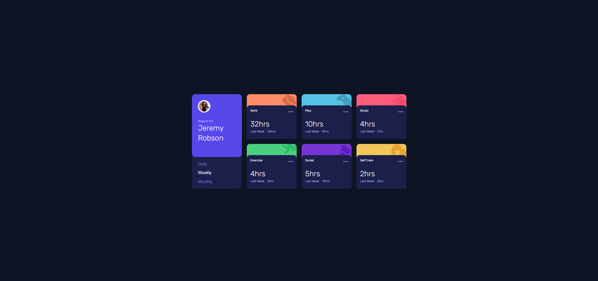

# Frontend Mentor - Time tracking dashboard solution

This is a solution to the [Time tracking dashboard challenge on Frontend Mentor](https://www.frontendmentor.io/challenges/time-tracking-dashboard-UIQ7167Jw).

## Table of contents

- [Overview](#overview)
  - [Screenshot](#screenshot)
  - [Links](#links)
- [My process](#my-process)
  - [Built with](#built-with)
- [Author](#author)

## Overview

### Screenshot

### Links

- Solution URL: (https://github.com/abdallahedreeso/Time-tracking-dashboard)
- Live Site URL: (https://time-tracking-dashboard-rho-one.vercel.app/)

## My process

### Built with

- Semantic HTML5 markup
- CSS custom properties
- Flexbox
- Mobile-first workflow
- React.js

## Author

- LinkedIn - [Abdallah Edrees] (https://www.linkedin.com/in/abdallah-edrees/)
- Frontend Mentor - [@abdallahedreeso](https://www.frontendmentor.io/profile/abdallahedreeso)
